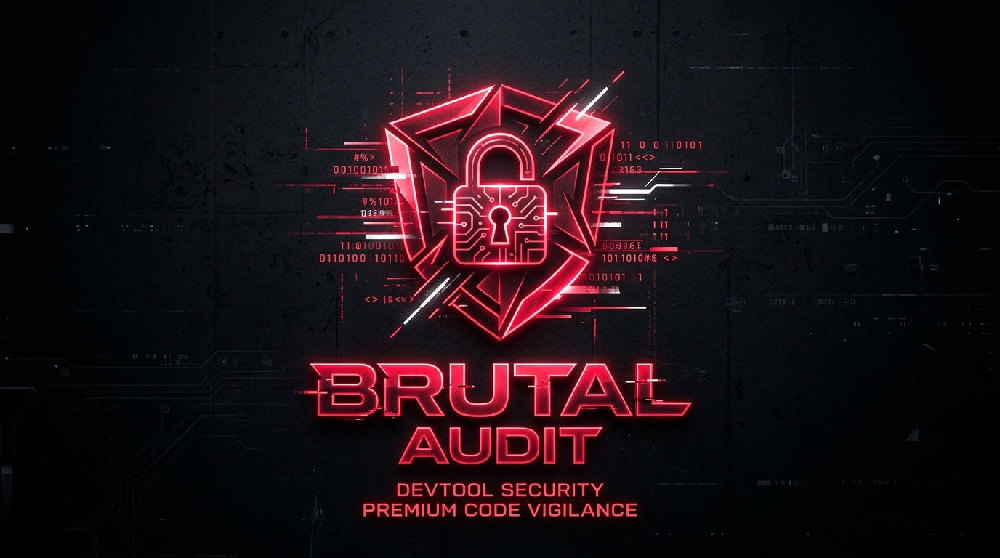
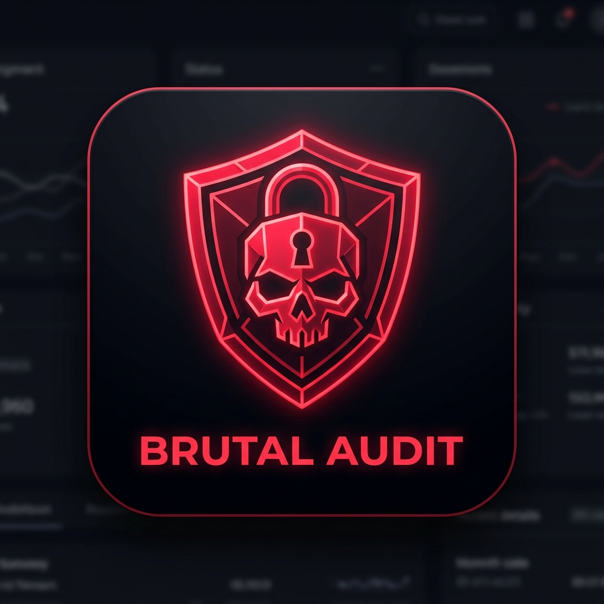

<p align="center">
  
</p>

<p align="center">
  <strong>Ruthless, Uncompromising, and 100% Concrete Security Auditor for AI Coding Agents</strong>
</p>

<p align="center">
  <a href="LICENSE"></a>
  <a href="https://www.npmjs.com/package/brutal-audit"></a>
  <a href="https://skills.sh"></a>
  <a href="https://github.com/Muhfaizr21/Brutal-audit/stargazers"></a>
  <a href="CONTRIBUTING.md"></a>
</p>

---

## ⚡ The Problem: Polite AI Is a Security Hazard

Most AI coding assistants (Claude, Cursor, Copilot, ChatGPT) are trained to be polite and agreeable. When you ask them to review your code, they respond with generic, textbook platitudes:

> *"Consider sanitizing your inputs."*  
> *"Make sure your dependencies are updated."*  
> *"It's recommended to implement rate limiting."*

**These vague recommendations won't stop an attacker from dumping your database.** They don't pinpoint the file, they don't give line numbers, they don't show the exploitation vector, and they don't provide copy-pasteable remediation code.

---

## 💀 The Solution: brutal-audit

**brutal-audit** is an open-source **Standard Agent Skill** and **Rule Enforcer** that transforms your AI coding agent into a **battle-hardened, cynical Principal Security Auditor**.

It strips away pleasantries and enforces deep **Taint Analysis**, **Static Application Security Testing (SAST)**, and **Threat Modeling** directly on your codebase.

| Standard AI Review | 🔒 brutal-audit |
| :--- | :--- |
| ❌ *"Sanitize inputs to avoid SQL Injection"* | ✅ **Exact line numbers and tainted parameters** |
| ❌ Vague general advice with no actionable code | ✅ **Copy-paste ready, drop-in replacement code** |
| ❌ *"Looks mostly secure"* (hallucinating safety) | ✅ **Conceptual Proof of Concept (PoC) exploit mechanics** |
| ❌ Misses subtle auth and token lifecycle flaws | ✅ **Mandatory 5-domain threat scan across the full stack** |

---

## ⚔️ The 6 Iron Rules (R-01 to R-06)

Every AI agent operating under `brutal-audit` is bound by 6 non-negotiable rules:

```
┌────────────────────────────────────────────────────────────────────────┐
│                        BRUTAL AUDIT ENGINE                             │
├──────────────┬─────────────────────────────┬───────────────────────────┤
│ Rule         │ Name                        │ Strict Requirement        │
├──────────────┼─────────────────────────────┼───────────────────────────┤
│ 🔴 R-01      │ 4-Tier Severity Matrix      │ CRITICAL/HIGH/MEDIUM/LOW  │
│ 📍 R-02      │ Pinpoint Code Localization  │ File + Line + Exact Code  │
│ 🛠️ R-03      │ Drop-in Concrete Fixes      │ Ready-to-copy code blocks │
│ 💥 R-04      │ Conceptual PoC Exploit      │ Real-world attacker vector│
│ 🔍 R-05      │ 5 Critical Surface Domains  │ Deep baseline coverage    │
│ 🚫 R-06      │ Zero Generic Advice         │ Safe or Flagged. Period.  │
└──────────────┴─────────────────────────────┴───────────────────────────┘
```

### 🔴 R-01: 4-Tier Severity Classification
- **🔴 CRITICAL**: Remote Code Execution (RCE), full database dump/wipe, complete authentication bypass.
- **🟠 HIGH**: Sensitive data exfiltration (PII, tokens, credential leaks), account takeover, privilege escalation.
- **🟡 MEDIUM**: Cross-Site Scripting (XSS), partial SSRF, session fixation, state-changing CSRF without token.
- **🔵 LOW**: Security header omissions, software version disclosure, minor configuration deviations.

### 📍 R-02: Exact Code Localization
Vague remarks like *"in the authentication handler"* are strictly prohibited. The auditor must output the exact file name, line number, and original code snippet.

### 🛠️ R-03: Copy-Paste Ready Remediation
No pseudo-code. No `// implement validation here`. Every finding must include a production-ready, fully functional code block written in the target language.

### 💥 R-04: Conceptual Proof of Concept (PoC)
The auditor must explain the mechanical steps an adversary takes to trigger the flaw, detailing crafted payloads and expected system behavior.

### 🔍 R-05: Mandatory 5 Critical Domains
Every audit unconditionally investigates:
1. **Hardcoded Secrets & API Keys** (Stripe, AWS, JWT secrets, DB credentials).
2. **Injection Flaws** (SQL, NoSQL, OS Command, SSRF, Path Traversal).
3. **Broken Authentication & Sessions** (Rate limiting, token lifecycles, timing attacks).
4. **Cross-Site Scripting (XSS)** (DOM, Reflected, Stored, unescaped templates).
5. **Vulnerable Dependencies & Insecure Defaults** (Known CVEs, wildcard CORS).

### 🚫 R-06: Zero Generic Bullshit
No generic lecture text. If a domain contains no flaws, the auditor must explicitly output:  
`✅ Safe: No [Domain Name] vulnerabilities found in submitted code.`

---

## 🚀 Installation

Install `brutal-audit` across any modern AI coding workflow in seconds:

<p align="center">
  
</p>

### Method 1: The Interactive CLI Picker (Recommended)
One command to auto-detect your development environment, select target agents, and configure global or local rule pointers:

```bash
npx brutal-audit
```

---

### Method 2: Official skills.sh Registry
Install via the universal agent skills directory:

```bash
npx skills add Muhfaizr21/brutal-audit
```
*Add `-g` for global installation across all projects.*

---

### Method 3: Claude Code Plugin
Add the repository directly to your Claude Code marketplace:

```text
/plugin marketplace add https://github.com/Muhfaizr21/Brutal-audit
/plugin install brutal-audit@Brutal-audit
```

---

### Method 4: Google Antigravity Plugin
Install seamlessly into Antigravity via the CLI:

```bash
agy plugin install https://github.com/Muhfaizr21/Brutal-audit
```

---

### Method 5: Cursor IDE
Copy the bundled rule directly into your project's `.cursor/rules/`:

```bash
mkdir -p .cursor/rules && cp .cursor/rules/brutal-audit.mdc .cursor/rules/
```
*Or simply reference `@brutal-audit` in your Cursor chat prompt.*

---

## 💻 Usage

Once installed, trigger an audit with clear, natural commands in your AI agent:

```markdown
Use brutal-audit to review routes/auth.js and controllers/payment.js. Find all vulnerabilities down to CRITICAL!
```

Or paste code directly into your session:

```markdown
Run a brutal-audit scan on this backend handler:
[paste your code snippet here]
```

---

## 📊 Gold Standard Output Format

Here is an authentic sample of what `brutal-audit` generates:

```markdown
### 📊 Audit Summary
| Severity | Count | Affected Components |
| :--- | :---: | :--- |
| 🔴 CRITICAL | 1 | Authentication Endpoint (`routes/login.js`) |
| 🟠 HIGH | 1 | Token Generator (`routes/login.js`) |
| 🟡 MEDIUM | 1 | Rate Limiting Logic (`routes/login.js`) |
| 🔵 LOW | 0 | - |

---

### 🔴 [CRITICAL] SQL Injection (Authentication Bypass)
- **Location**: `routes/login.js` | **Line**: 8
- **Vulnerable Code**:
```javascript
const sql = "SELECT id, email, role FROM users WHERE email = '" + email + "' AND password = '" + password + "'";
```
- **Exploitation (PoC)**: An attacker submits the payload `' OR '1'='1` in the `email` field. The SQL engine executes:
```sql
SELECT id, email, role FROM users WHERE email = '' OR '1'='1' AND password = ''
```
The expression `'1'='1'` evaluates to TRUE, causing the query to return the first record in the database (typically administrator) and bypassing authentication without a valid password.
- **Concrete Solution**:
```javascript
const sql = 'SELECT id, email, role FROM users WHERE email = $1 AND password = $2';
const user = await db.query(sql, [email, password]);
```
- **References**: OWASP Top 10:2021-A03 (Injection), CWE-89.

---

### 🛡️ 5 Critical Surface Domains
- **Hardcoded Secrets**: 1 finding (🟠 HIGH: Static token string detected on line 11).
- **Injection**: 1 finding (🔴 CRITICAL: Raw SQL concatenation detected on line 8).
- **Broken Authentication & Session**: 1 finding (🟡 MEDIUM: Missing rate limiting on line 6).
- **Cross-Site Scripting (XSS)**: ✅ Safe: No XSS vulnerabilities found in submitted code.
- **Dependency Vulnerability**: ✅ Safe: No vulnerable third-party dependencies identified.

---

### ✅ Final Verdict
This system is **NOT SAFE** for production deployment.
```

---

## 📂 Repository Architecture

```
brutal-audit/
├── assets/
│   ├── banner.png               # High-resolution branding banner
│   └── logo.png                 # Official square logo emblem
├── bin/
│   └── cli.js                   # Zero-dependency multi-agent interactive installer
├── skills/
│   └── brutal-audit/
│       └── SKILL.md             # Standard agent skill specification
├── rules/
│   └── brutal-audit.md          # Global rule enforcement pointer
├── examples/
│   ├── vulnerable-code.js       # Reference vulnerable testbed
│   └── audit-report.md          # Sample gold-standard audit report
├── .claude-plugin/
│   └── plugin.json              # Claude Code plugin manifest
├── .codex-plugin/
│   └── plugin.json              # OpenAI Codex plugin manifest
├── .cursor/
│   └── rules/
│       └── brutal-audit.mdc     # Cursor IDE rule descriptor
├── guide.md                     # Comprehensive installation guide
├── SKILL.md                     # Root skill definition
├── plugin.json                  # Google Antigravity plugin manifest
├── package.json                 # NPM packaging & bin manifest
└── README.md                    # Primary documentation
```

---

## 🤝 Contributing

Contributions to rules, heuristics, and agent adapters are welcome! See [CONTRIBUTING.md](CONTRIBUTING.md) for details on submitting Pull Requests.

---

## 📄 License

This project is licensed under the [MIT License](LICENSE).
<br>
Built with precision for developers who refuse to ship vulnerable code.